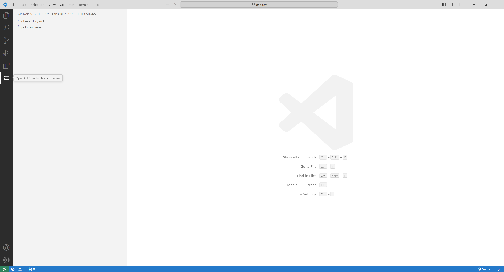
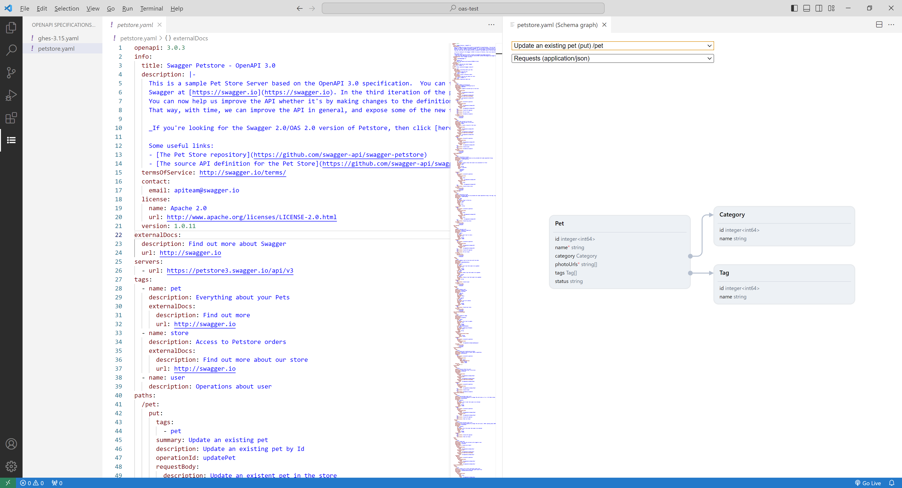

# VS Code Qubership APIHUB Extension

VS Code Qubership APIHUB extension is a prototype which brings a piece of APIHUB functionality- graphical representation of OpenAPI specification data model for request body and specific response codes into VS Code.

Install the extension [manually](https://code.visualstudio.com/docs/editor/extension-marketplace#_install-from-a-vsix).

You can browse a list of OpenAPI specifications in the workspace by clicking on the list icon in the **Activity Bar**. 

Clicking on the specification in the list will open it in the Editor and simultaneously opens graphical representation of data model.

You can select viewing context using drop-downs in the top part of the graph panel.

You can edit the specification and save it- diagram will be updated on save.

If the specification could not be parsed due to some error- the error will be presented on top of the graph. Once specification is fixed and saved, the graph will be updated.

Both single file and multi-file specifications are supported.

Supports data models with cycles.

**Disclaimer**- in its current state it is a technology prototype and not ready-to-use production quality product, nontheless it could be usefull in some scenarious.

Known limitations:
- only first workspace folder is scanned for OpenAPI specification
- rudimentary UI
- not tested extensively, could contain verious bugs
- performance problems on very large specifications